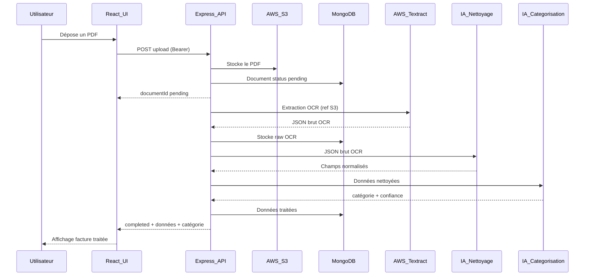

# Gestion de factures PDF — OCR, IA et architecture n-tiers

Application web pour **réduire la saisie manuelle** sur les factures et documents PDF : import, **extraction automatique des données**, **catégorisation par IA**, stockage et consultation sécurisés. Le périmètre couvre notamment les factures et devis, avec une architecture **front React**, **API Express**, **MongoDB**, **fichiers sur AWS S3**, **OCR AWS Textract** et **modèles IA** pour le post-traitement et la catégorisation (voir les ADR dans `docs/adr/`).

---

## Application en général

L’objectif est d’**améliorer et accélérer l’organisation documentaire** en entreprise : moins de ressaisie, des métadonnées **normalisées**, et un accès contrôlé aux informations sensibles.

**Rôle du système :**

- Recevoir des PDF (unitaire ou lot, glisser-déposer possible).
- Les stocker de façon durable (**AWS S3**).
- Extraire le texte et la structure utile (**AWS Textract**).
- Transformer le JSON OCR brut en **schéma métier stable** (nettoyage, dates, montants, fournisseur, etc.) via un **composant IA**.
- Attribuer une **catégorie** (ex. facture, devis) via un **modèle de catégorisation**.
- Persister l’historique et les résultats (**MongoDB**), et les exposer via une **API REST** consommée par une **interface React** (responsive web, mobile / tablette / desktop selon les ADR de déploiement).

**Documentation d’architecture :** décisions détaillées dans [`docs/adr/`](docs/adr/) (ex. [ADR-1 — définition de l’application](docs/adr/0001-application.md), [ADR-6 — microservices](docs/adr/0006-architecture-microservices.md)).

---

## Fonctionnalités principales

| Domaine | Fonctionnalités |
|--------|------------------|
| **Documents** | Envoi simple ou en lot, glisser-déposer, prévisualisation / téléchargement du PDF, CRUD et recherche / filtrage. |
| **Automatisation** | Extraction OCR des champs clés, normalisation IA du JSON, catégorisation automatique avec indicateur de confiance. |
| **Sécurité** | Authentification, sessions, contrôle d’accès par rôles (administrateur / utilisateur) — voir [ADR-25](docs/adr/0025-authentification.md). |
| **Qualité** | Tests unitaires côté serveur, tests E2E Playwright sur les parcours critiques — voir [ADR-14](docs/adr/0014-tests-e2e-interface-playwright.md), [ADR-15](docs/adr/0015-tests-unitaires-cote-serveur.md). |

Les cas d’usage détaillés (inscription, recherche, statistiques, etc.) sont schématisés dans [`diagrams/usecase.puml`](diagrams/usecase.puml).

---

## Pipeline de la fonctionnalité principale — envoi de facture, OCR et IA

Flux métier cible, aligné sur la séquence [send_file.puml](diagrams/sequence/send_file.puml) :

1. **Téléversement** — L’utilisateur sélectionne un PDF dans l’UI React. L’API Express valide le JWT et le fichier, envoie le PDF vers **S3**, crée un enregistrement document en base avec un statut du type `pending`, et renvoie `documentId` + statut.
2. **OCR** — L’API déclenche **AWS Textract** sur la référence S3, récupère un **JSON brut**, stocké côté MongoDB (zone « raw » / sortie Textract).
3. **Nettoyage et structuration IA** — Le JSON OCR est envoyé au **modèle de nettoyage** ; la réponse fournit des champs structurés (ex. numéro de facture, date, fournisseur, montant). L’API valide ces données extraites.
4. **Catégorisation IA** — Les données nettoyées sont envoyées au **modèle de catégorisation** ; réponse : catégorie + score de confiance. Persistance en zone « processed » dans MongoDB.
5. **Résultat** — L’API renvoie le statut `completed` avec les données extraites et la catégorie ; l’interface affiche la facture traitée.

Références : [ADR-8 — OCR / PDF](docs/adr/0008-ocr-extraction-donnees-pdf.md), [ADR-9 — post-traitement IA du JSON OCR](docs/adr/0009-modele-ia-nettoyage-structuration-json-ocr.md), [ADR-4 — modèles IA](docs/adr/0004-conception-modele-ia.md).

**Vue synthétique (Mermaid)**

---

## Diagrammes (`diagrams/`)

Le dossier [`diagrams/`](diagrams/) contient des diagrammes **PlantUML** (`.puml`) :

| Fichier | Contenu |
|---------|---------|
| [`diagrams/usecase.puml`](diagrams/usecase.puml) | Cas d’usage : authentification, gestion des documents, recherche / filtres, administration. |
| [`diagrams/sequence/send_file.puml`](diagrams/sequence/send_file.puml) | Séquence **téléversement + OCR + IA + persistance** (flux principal). |
| [`diagrams/sequence/register.puml`](diagrams/sequence/register.puml) | Séquence d’**inscription** utilisateur. |
| [`diagrams/classe/classe.puml`](diagrams/classe/classe.puml) | Diagramme de **classes** du domaine. |

Pour les visualiser : extension PlantUML dans l’éditeur, ou outil en ligne / CLI PlantUML selon votre environnement.

---

## CI/CD et pipelines

**Décision d’architecture (ADR)** : automatisation avec **GitHub Actions**.

- **Déploiement — `deploy.yml`** ([ADR-16](docs/adr/0016-github-pipeline-deploy-yml.md))
  - Fichier cible : `.github/workflows/deploy.yml`.
  - Idée : déclenchement sur événements GitHub, étapes de **vérification** (build, tests, qualité), puis **déploiement** vers l’environnement cible ; secrets dans **GitHub Secrets**.

- **Release — `release.yml`** ([ADR-17](docs/adr/0017-github-pipeline-release-yml.md))
  - Fichier cible : `.github/workflows/release.yml`.
  - Idée : création de **release** à partir d’un **tag / version**, publication d’**artefacts**, traçabilité des versions.

**Exploitation associée** : monitoring et logging centralisés ([ADR-20](docs/adr/0020-monitoring-logging-centralises.md)), sauvegardes / restauration ([ADR-21](docs/adr/0021-strategie-sauvegarde-restauration.md)), gestion d’incidents et runbooks ([ADR-23](docs/adr/0023-gestion-incidents-runbooks.md)), politique de mises à jour des dépendances ([ADR-22](docs/adr/0022-politique-maj-dependances-securite.md)).

> **Note :** les workflows `.github/workflows/deploy.yml` et `release.yml` sont la **cible** décrite dans les ADR ; ils sont **à créer ou à versionner** dans le dépôt conformément aux ADR-16 et ADR-17 (ce dépôt ne les contient pas encore).

---

## Stack et outils (rappel)

- **TypeScript** — client et serveur.
- **React** + **Express** + **MongoDB** + **Docker Desktop** + **AWS S3 / Textract**.
- **Figma** pour la conception UI.
- Outils de dev / exploitation : voir [ADR-24](docs/adr/0024-outils-developpement-et-exploitation.md).

---

## Pour aller plus loin

- Décisions d’architecture : [`docs/adr/`](docs/adr/).
- Jeu de données et tests modèle IA : [ADR-10](docs/adr/0010-dataset-entrainement-tests-modele-ia.md).
